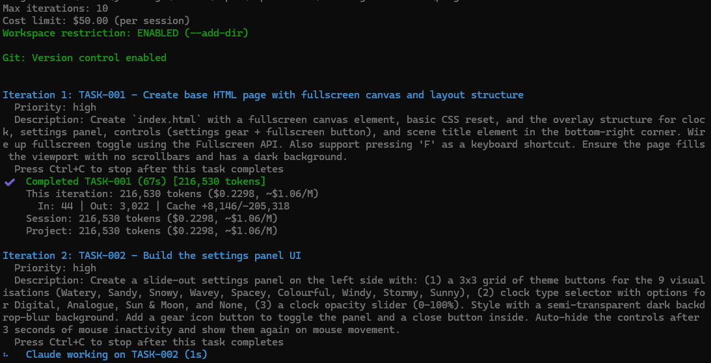

# DevLoop

Automate iterative development with Claude Code. DevLoop helps you break down projects into small tasks and automatically executes them in a loop using Claude.



## How It Works

1. **Define requirements** - Use an interactive Claude session to break your project into small tasks (~30 min each)
2. **Run the loop** - DevLoop picks the next task, spawns Claude to complete it, logs progress, and repeats
3. **Track progress** - View task status and iteration logs at any time

Each iteration runs in a fresh Claude context, so you get consistent behavior without context buildup.

## Installation

### Windows

```powershell
# Navigate to the DevLoop directory
cd C:\path\to\DevLoop

# Install dependencies
npm install

# Build the TypeScript
npm run build

# Link globally (run as Administrator if you get permission errors)
npm link
```

After linking, `devloop` is available from any terminal window.

### macOS / Linux

```bash
cd /path/to/DevLoop
npm install
npm run build
npm link
```

You may need `sudo npm link` if you get permission errors.

### Verify Installation

```bash
devloop --version
devloop --help
```

## Uninstallation

### Remove Global Link

```powershell
# Windows (run from DevLoop directory)
npm unlink

# Or remove by package name from anywhere
npm uninstall -g devloop
```

```bash
# macOS / Linux
npm unlink
# or
sudo npm uninstall -g devloop
```

### Clean Up Config Files

DevLoop stores configuration in your home directory:

```powershell
# Windows - remove global config
rmdir /s /q %USERPROFILE%\.devloop
```

```bash
# macOS / Linux - remove global config
rm -rf ~/.devloop
```

Workspace files (`requirements.md`, `progress.md`, `CLAUDE.md`, `.devloop/`) are stored in each project directory and can be deleted manually if no longer needed.

## Quick Start

```bash
# 1. Navigate to your project directory
cd C:\Projects\MyApp

# 2. Create requirements.md interactively with Claude
devloop init

# 3. Check your tasks
devloop status

# 4. Run the loop (10 iterations by default)
devloop run

# 5. Come back later and continue
devloop continue
```

## Tips for `devloop init`

When you run `devloop init`, DevLoop creates a placeholder `requirements.md` and then opens an interactive Claude session. Here's what to expect:

- **Claude will ask to overwrite the file** — say yes. The placeholder is just a template; Claude needs to replace it with your actual tasks.
- **Describe what you want to build.** Include any preferences for technologies, libraries, or approaches. Claude will break your idea into small tasks (~30 min each) with dependencies.
- **Don't ask Claude to start building the project.** The init session is only for creating the requirements document. Implementation happens later when you run `devloop run`. If Claude starts writing code or creating files, remind it to just write the requirements doc.
- **Review the tasks before exiting.** Ask Claude to adjust priorities, split large tasks, or add missing steps. It's much easier to fix the plan now than after tasks have started running.
- **Exit when you're happy** with Ctrl+C or `/exit`. DevLoop will commit the requirements and you can start running tasks.

## Commands

### `devloop init`

Starts an interactive Claude session to create your `requirements.md` file. Claude helps you break down your project into small, actionable tasks.

If a `requirements.md` already exists but DevLoop hasn't been initialized (no `.devloop/` folder), the command will **adopt** the existing file and set up the necessary infrastructure, allowing you to use `devloop run` immediately.

```bash
devloop init                    # Use default/configured workspace
devloop init -w ./my-project    # Specify workspace
devloop init --force            # Overwrite existing requirements.md and reinitialize
```

**Behavior with existing files:**
- `requirements.md` exists + no session → Adopts existing file, creates infrastructure
- `requirements.md` exists + session exists → Prompts to use `continue` or `--force`
- No `requirements.md` → Creates template and starts fresh

### `devloop run`

Executes tasks from `requirements.md` in a loop. Each iteration:
1. Parses requirements.md to find the next pending task (respecting dependencies)
2. Spawns Claude with the task details
3. Claude completes the task and marks it done
4. Logs the result to progress.md
5. Repeats until all tasks done or max iterations reached

```bash
devloop run                     # Run with defaults (10 iterations)
devloop run -n 5                # Limit to 5 iterations
devloop run -t 500000           # Stop when session tokens exceed 500k
devloop run -c 5                # Stop when session cost exceeds $5
devloop run -v                  # Verbose output (show Claude's work)
devloop run --dry-run           # Show what would run without executing
devloop run -w ./my-project     # Specify workspace
```

### `devloop status`

Shows current progress and task list.

```bash
devloop status                  # Human-readable output
devloop status --json           # JSON output for scripting
```

### `devloop continue`

Resume work after a break. Prompts you to choose:
- **Continue requirements** - Resume refining requirements.md with Claude
- **Continue run** - Resume task execution from where you left off

```bash
devloop continue
devloop continue -n 20          # Continue run with 20 max iterations
devloop continue -t 500000      # Continue with token limit
devloop continue -c 5           # Continue with $5 cost limit
```

### `devloop workspace`

View or set the default workspace directory.

```bash
devloop workspace               # Show current default
devloop workspace C:\Dev        # Set default workspace
```

## File Structure

DevLoop creates these files in your workspace:

```
my-project/
├── requirements.md       # Your tasks (you + Claude create this)
├── progress.md           # Iteration logs (auto-generated)
├── CLAUDE.md             # Context for Claude (auto-generated)
└── .devloop/
    ├── session.json      # Session state for resuming
    └── config.json       # Workspace config (commit format, etc.)
```

Global config is stored at `~/.devloop/config.json`.

## Task Format

Tasks in `requirements.md` follow this format:

```markdown
### TASK-001: Set up project structure
- **Status**: pending
- **Priority**: high
- **Dependencies**: none
- **Description**: Initialize with package.json and tsconfig.json.

### TASK-002: Implement user authentication
- **Status**: pending
- **Priority**: high
- **Dependencies**: TASK-001
- **Description**: Create login endpoint with JWT tokens.
```

- **Status**: `pending`, `in-progress`, or `done`
- **Priority**: `high`, `medium`, or `low` (higher priority tasks run first)
- **Dependencies**: `none` or comma-separated task IDs (e.g., `TASK-001, TASK-002`)

## Progress Indicators

DevLoop provides visual feedback during execution:

- **Terminal title**: Shows current iteration, task ID, and progress (e.g., "DevLoop: 3/10 - TASK-005 (2/12 done)")
- **Animated spinner**: Displays elapsed time while Claude works on a task
- **Final status**: Terminal title updates to show completion status

## Graceful Shutdown

DevLoop supports graceful shutdown during task execution:

- **First Ctrl+C**: Requests graceful stop - the current task will complete, then DevLoop stops
- **Second Ctrl+C**: Warning that next press will force stop
- **Third Ctrl+C**: Force stops immediately (may leave work incomplete)

This allows you to stop the loop without interrupting Claude mid-task.

## Interrupted Work Recovery

If a task is interrupted (e.g., force Ctrl+C during execution), DevLoop detects and preserves partial work:

- **Detection**: At the start of each run, DevLoop checks for uncommitted git changes
- **Commit**: If uncommitted changes exist, they are committed with a message like `DevLoop: Interrupted work on TASK-001 - Task title`
- **Fresh start**: Claude then starts fresh with a clean working tree
- **Failure handling**: If the commit fails, DevLoop stops and provides instructions for manual resolution

The partial work is preserved in git history. If it was needed (and tests fail without it), you can recover it from the commit.

If DevLoop cannot commit the uncommitted changes (e.g., git configuration issues), it will stop and ask you to resolve manually using `git status`, then either commit or discard the changes before running `devloop continue`.

## Commit Message Format

DevLoop commits use a configurable format with an `{action}` placeholder that gets replaced with what DevLoop did.

- **Default format**: `DevLoop: {action}`
- **Example actions**: "Initialize workspace", "Complete TASK-001 - Fix bug", "Attempted TASK-002 - Add feature"

**Auto-detection during init**: When you run `devloop init`, DevLoop detects commit hooks (commitlint, husky, git hooks). If hooks are found, you're prompted for a commit message format.

**Manual configuration**:

```bash
devloop config set devloopCommitFormat "chore(devloop): {action}"
devloop config list                    # Show current config
```

**Hook failure handling**: If a commit fails due to a hook, DevLoop displays the error, prompts you for a valid commit message (with `{action}` placeholder), retries, and saves the format for future commits.

## Safety

When running automated tasks, DevLoop restricts Claude to your workspace:

- Uses `--add-dir <workspace>` to limit file operations
- Prompts explicitly state workspace boundaries
- Dangerous commands (rm -rf /, sudo, etc.) are blocked in settings

## Token Tracking

DevLoop tracks API token usage across iterations:

- **Per-iteration tracking**: Each iteration logs input tokens, output tokens, and cost
- **Cumulative display**: After each task, shows running total of tokens used
- **Token limits**: Use `-t, --token-limit` to stop before exceeding a token threshold
- **Cost limits**: Use `-c, --cost-limit` to stop before exceeding a dollar amount
- **Status display**: `devloop status` shows total tokens and cost for the project

Token data is stored in `progress.md` and persists across sessions.

## API Error Handling

DevLoop automatically detects and handles API-level errors:

- **Rate limits** (400/429): Stops the loop and displays the error message
- **Authentication errors** (401): Stops and prompts to check credentials
- **API overload** (503): Stops and suggests retrying later
- **Network errors**: Stops on connection failures

Task failures (Claude ran but couldn't complete the task) continue to the next iteration, as a future attempt may succeed.

When `devloop status` is run after a failure, it displays:
- Error type (rate_limit, auth_error, etc.)
- Error summary and detailed message
- Timestamp of the failure

## Feature Mode

Feature mode lets you organize work into independent features, each with their own requirements, progress tracking, and session state. This is useful for larger projects where you want to work on multiple features in parallel without mixing their tasks.

### File Structure

```
my-project/
├── requirements/
│   ├── auth.md              # Feature-specific requirements
│   └── dashboard.md
├── progress/
│   ├── auth.md              # Feature-specific progress
│   └── dashboard.md
└── .devloop/
    └── features/
        ├── auth.json        # Feature session state
        └── dashboard.json
```

### Usage

Use the `--feature <name>` flag on any command:

```bash
devloop init --feature auth           # Create requirements/auth.md
devloop run --feature auth            # Run tasks for auth feature
devloop continue --feature auth       # Continue auth feature
devloop status --feature auth         # Check auth feature status
```

### Managing Features

```bash
devloop feature list                  # List all features
devloop feature status                # Summary of all features
```

### Quick Example

```bash
# Create two independent features
devloop init --feature auth
devloop init --feature dashboard

# Work on them independently
devloop run --feature auth -n 5
devloop run --feature dashboard -n 5

# Check overall status
devloop feature status
```

## Requirements

- Node.js >= 20.0.0
- [Claude Code CLI](https://claude.ai/code) installed and authenticated
